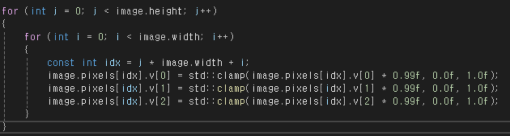

## 이미지 밝게 만들기

이미지를 밝게 만들기위해 픽셀값에 1.2f를 곱해줬다.

하지만 result.png를 확인해보면 조명 근처의 밝은 빛의 색깔이 깨져있는게 확인된다. 

이런 현상이 일어나는 이유는 밝은 색깔에 1.2를 곱해주면 결과값이 1.0보다 커질 수 있기 때문에 그상태에서 255를 곱하고unsigned char로 casting을 하면 overflow때문에 우리가 원하는 값이 아니라 작은 값으로 바뀌어버릴 수 있다.

이렇게 범위가 어긋나는 문제를 방지하기 위해서 **std::clamp** 를 사용하여 범위를 0.0이상, 1.0이하로 맞춰주면 해결된다.

- **std::clamp**

코드를 위와 같이 고치고 result.png를 확인해봤더니 색깔이 깨지지 않고 잘 나타났다.

---

## 애니메이션 효과 만들기 

이번엔 사진을 점점 어두워지는 간단한 애니메이션을 구현해 보았다.

Update함수는 매번 호출이 되기때문에 0.99를 계속 곱해주면 어두워지는 효과가 만들어진다.

이번엔 조금 다르게 1차원 배열을 2차원 배열처럼 사용하여 똑같은 효과를 구현하였다. 결과는 똑같다.

이중 포문을 사용하게 되면 공간 분할이 쉬워지기 때문에 왼쪽 절반은 어두워지게, 오른쪽 절반은 밝아지는 효과도 구현해보았다.

