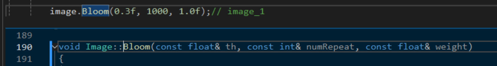
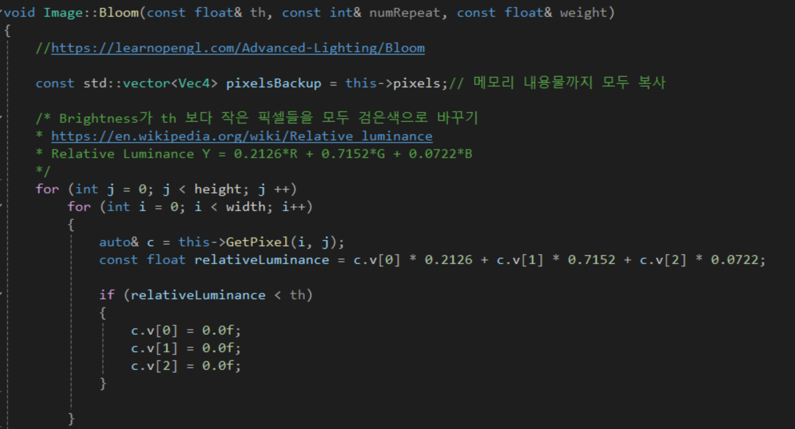
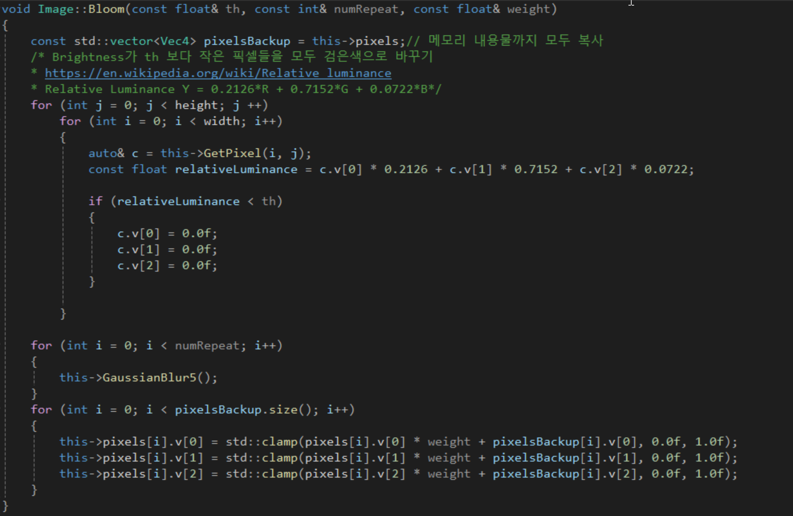
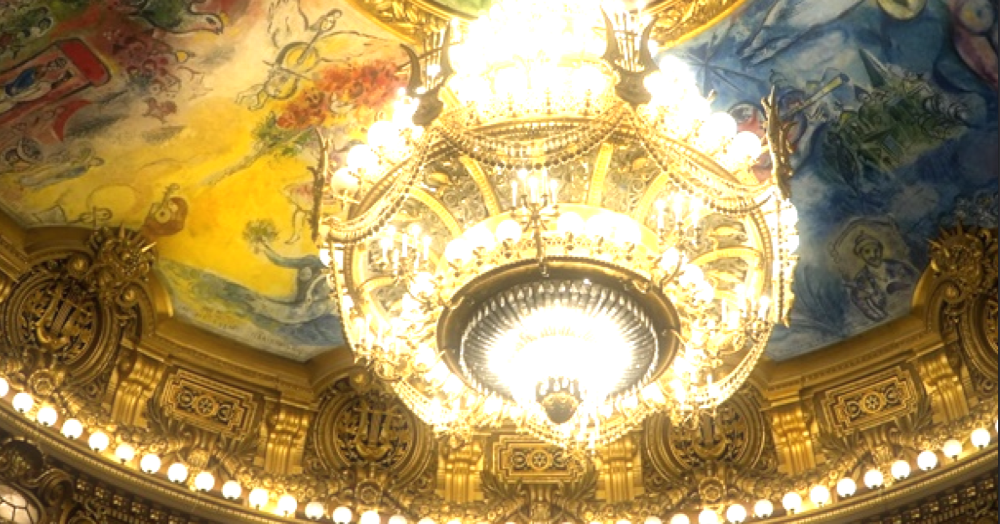

## Bloom Effect
블룸 효과를 만드는 첫번째 단계는 밝은 픽셀은 그냥 두고, 어두운 픽셀은 까맣게 만드는 것이다. 그렇게 만들기 위해선 어떤 픽셀이 밝은지 어두운지에 대한 기준이 필요하다. 기준을 정하기 위한 Bloom함수를 만들것이다.

---

## Bloom함수 구현

Bloom 함수는 3개의 arguments가 들어간다.
- 첫번째 0.3이 밝은 숫자인지 어두운 숫자인지를 결정하는 숫자이다. 
- 두번째는 가우시안 블러를 반복하는 횟수이다.
- 세번째는 옵션이다. 원본 image와 blur처리된 image를 합칠때 합쳐진 image에 곱해주는 숫자이다.
블룸 효과를 약하게 주고싶다면 이 숫자를 줄이면 된다.

밝기 라는 것은 red, green, blue를 섞은 값인데 Relative Luminance Y에 곱해준 숫자들은 과학자들이 실험을 통해 얻은 값이다. 사람이 색을 봤을때 녹색 성분이 강하면 밝다고 느낀다고 한다. 반대로 blue색깔은 밝기에 영향을 별로 미치지 않기 때문에 각각의 색깔에 곱해주는 숫자가 다르다.

어두운 픽셀만 0.0f로 만들어주고 밝은 픽셀은 그대로 두고 실행한 결과 아래와 같은 결과가 나왔다.

이제 밝은 픽셀만 남겨두었으니 앞에서 구현한 Gaussian Blur를 적용하면 된다.

Gaussian Blur를 적용한 결과이다. 어두운 부분은 완전히 까맣게 되었고 밝은 부분은 빛이 퍼져서 더 밝아진 것을 볼 수 있다.

마지막으로 이 이미지를 이제 원본 이미지와 블러 처리가 된 이미지를 더해주면 블룸 효과가 완성된다.
두 이미지를 더하고 있기 때문에 clamp를 통해서 색깔값의 범위도 정리를 해주었다.

- 완성된 Bloom 효과

---