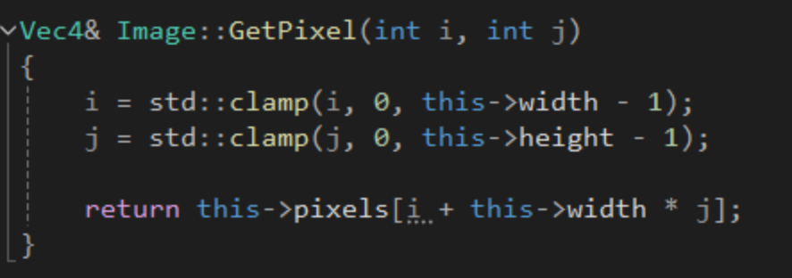

## Blur의 종류

- 커널의 각 원소 값에 해당하는 픽셀의 값을 곱한 후 그 값을 모두 더한 후 커널의 크기로 나누어서 픽셀의 값을 구한다.
- Kernal이 커질수록 더 많은 픽셀을 포함하기 때문에 더 많은 픽셀을 평균내어 더 많이 흐려지는 것을 볼 수 있다.
- 커널이라는 것이 이미지에 어떻게 적용되는지 보자.

---

## Convolution

커널을 이미지의 모든 픽셀에 적용시키는 것.
커널의 크기가 3x3이라면 3x3의 커널을 이미지의 모든 픽셀에 적용시킨다.

계산은 각 픽셀 값에 해당하는 위치의 커널의 값과 곱하고 그 값을 모두 더하면 된다.

Gaussian blur를 할때는 **separable convolution**을 사용한다.

---

## Separable convolution

원래 convolution은 주변 픽셀들을 모두 평균을 내서 가운데 있는 픽셀 값을 구하는 것이지만 separable convolution은 1차원 kernal을 사용한다.

가운데 있는 픽셀 가로줄에 있는 5개의 값들을 먼저 평균을 내고 그 결과를 가지고 다시 새로방향으로 1차원 convolution을 적용한다.

---

## Box Blur 구현 

먼저 가로방향 blur를 구현하였다. 근처의 5개 픽셀을 평균내어 가운데 있는 픽셀의 값에 대입한다.

여기서 사용한 GetPixel 함수는 clamp를 사용하여 범위 밖에 있는 값들을 처리해준다.

이 사진을 예를 들어 설명하면 i-2와 i-1이 범위 밖에 있을때는 i=0에 해당하는 값을 i-1과 i-2에 clamp되어 평균을 계산하는 것이다.

실행 결과 이미지가 가로방향으로 흐려진 것을 볼 수 있다.
이제 전체 이미지에 세로방향 blur를 적용하면 된다. 세로방향 blur는 GetPixel함수에서 x와 y를 바꾸어주면 끝이다.

- 세로방향 Blur까지 적용한 결과

---

## Gaussian Blur 구현

Gaussian Blur는 가우시안 함수를 사용하여 모든 픽셀들을 동등하게 평균을 내는게 아니라 중심에 있는 픽셀에 가중치를 더 주고, 중심에서 멀리 있는 픽셀에는 가중치를 덜 주는 방식이다.

Gaussian Blur는 weights를 사용한다는 점 외에는 Box Blur와 동일하다. Box Blur를 구현한 코드에서 모두 더해서 0.2를 곱하는 대신 해당하는 index의 weights를 곱해주면 끝이다.

- 실행결과

Blur효과를 애니메이션으로 구현하려면 Update함수에서 Blur함수를 호출하면 된다.

---

## Reference
- [Gaussian blur](https://en.wikipedia.org/wiki/Gaussian_blur)

- [Convolution](https://en.wikipedia.org/wiki/Convolution)

---
